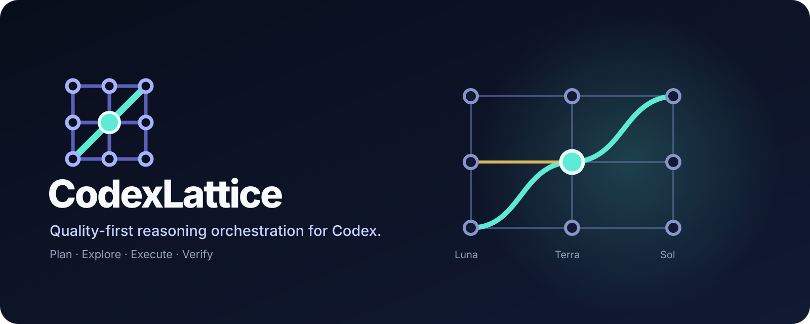

<div align="center">
  
</div>

<div align="center">

[English](README.md) · [简体中文](README.zh-CN.md)

[](https://github.com/hamburger-os/CodexLattice/actions/workflows/ci.yml)


</div>

# CodexLattice

**Quality-first reasoning-resource orchestration for Codex using GPT-5.6 Sol, Terra, and Luna.**

CodexLattice routes planning, exploration, execution, and verification through native Codex agent roles. It tries to stay inside a near-optimal quality envelope first, then uses the least expensive eligible route. Quality is the constraint; cost is the tie-breaker.

> **Current release: v0.2.7.** Installation and runtime enforcement are fail-closed: CodexLattice validates the real Codex CLI, installs route-specific native roles, records hashes in a receipt, and refuses to run when the validated state drifts.

## Quick start

Prerequisites: **Node.js >= 20** and **Codex CLI >= 0.149.0**. CodexLattice v0.2.7 is integration-tested against Codex 0.149.1.

```bash
npm install -g @openai/codex
npm install -g https://github.com/hamburger-os/CodexLattice.git

codex-lattice install adaptive
codex-lattice doctor --strict
codex-lattice run "refactor authentication across three modules"
```

CodexLattice does not silently install, replace, or reconfigure Codex sandbox/approval settings.

## What it changes

Instead of relying on prompt-time `model` or `reasoning_effort` overrides, CodexLattice installs native route roles such as:

```text
lattice_plan_sol_high
lattice_explore_luna_low
lattice_execute_terra_medium
lattice_verify_sol_max
```

Each role pins its own model and reasoning effort in a Codex role configuration. The runtime selects the exact agent type for each lifecycle stage.

```text
                    USER TASK
                       │
                       ▼
                ┌─────────────┐
                │ Task signals │
                └──────┬──────┘
                       │
                       ▼
                ┌──────────────┐
                │ Route policy │
                └──────┬───────┘
                       │
        ┌──────────────┼──────────────┐
        ▼              ▼              ▼
      Luna           Terra            Sol
   lightweight      balanced          deep
        │              │              │
        └──────────────┼──────────────┘
                       ▼
        PLAN → EXPLORE → EXECUTE → VERIFY
                       │
                       ▼
              Native Codex agents
```

## Why

Static recipes such as “Sol plans, Terra codes, Sol reviews” can waste stronger-model calls on easy work while still under-spending on risky work. CodexLattice uses a stage-aware policy:

- **Plan:** Terra for ordinary work; Sol when ambiguity, architecture, or risk demands it.
- **Explore:** Luna by default, with bounded parallelism for independent repository questions.
- **Execute:** Luna/Terra when predicted quality remains near the ceiling; escalate on evidence.
- **Verify:** deterministic checks first; stronger review for high-risk, disagreement, or incomplete validation.
- **Critical ceiling:** maximum reasoning is reserved for critical planning/verification paths.
- **Fallback:** `single` mode removes CodexLattice-managed orchestration and returns control to the user's original Codex configuration.

## Objective

For candidate routes `r`:

1. Estimate task-conditioned quality `Q(r | task, stage)`.
2. Find the predicted quality ceiling `Q*`.
3. Keep routes with `Q(r) >= Q* - δ`.
4. Among those routes, minimize nominal cost, then latency.
5. For high-risk work, set `δ = 0`.

This is lexicographic optimization: quality is not traded away through a cost weight. The current quality model is intentionally simple and inspectable. `cost` is a ranking index, **not** a billing estimator.

## Inspect before you run

```bash
codex-lattice explain "refactor authentication across three modules"
codex-lattice explain --trace "refactor authentication across three modules"
codex-lattice shadow "refactor authentication across three modules"
```

`explain` shows the selected lifecycle routes. `--trace` includes the candidate set and rejection reasons. `shadow` gives a counterfactual view against a Sol-medium single-agent reference without claiming measured savings.

## Installation integrity

`codex-lattice install adaptive` performs a transaction rather than a cosmetic config edit. It:

1. verifies a supported `codex` binary;
2. verifies the runtime model/config override surface;
3. backs up the existing Codex config;
4. preserves unrelated user-defined agent roles;
5. writes route-specific native role files;
6. registers them in a clearly delimited managed block;
7. asks the installed Codex CLI to parse the active configuration;
8. verifies that an effective multi-agent backend is enabled;
9. records config and role hashes in an installation receipt;
10. rolls back automatically when native validation fails.

Validate at any time:

```bash
codex-lattice doctor --strict
```

`run` refuses to start when the validated installation is missing, stale, modified, or was validated against a different Codex CLI version.

## Modes and uninstall

```bash
# Remove CodexLattice orchestration while preserving the user's baseline config
codex-lattice mode single

# Re-enable and revalidate adaptive orchestration
codex-lattice mode adaptive

# Remove only CodexLattice-managed config, roles, and receipt
codex-lattice uninstall
```

## Local telemetry (opt-in)

Telemetry is disabled by default and stays local. Raw task text is never written by CodexLattice telemetry.

```bash
codex-lattice telemetry on
codex-lattice telemetry status
codex-lattice telemetry summarize

codex-lattice feedback <run-id> pass
codex-lattice feedback <run-id> mixed "tests pass but implementation is too invasive"
```

See [`docs/evaluation.md`](docs/evaluation.md) for the paired-evaluation and calibration protocol.

## Evidence and proof boundary

The repository currently proves installation and configuration behavior more strongly than outcome quality.

CI runs unit/configuration tests on Linux, macOS, and Windows. A real-Codex smoke matrix installs `@openai/codex@0.149.1`, globally installs CodexLattice, validates a temporary `CODEX_HOME`, requires `doctor --strict`, verifies an enabled multi-agent backend and the expected GPT-5.6 route slugs, exercises `single → adaptive`, and confirms uninstall restores the baseline configuration.

It deliberately **does not** claim:

- that heuristic quality values are calibrated probabilities;
- that multiple cheaper agents equal one stronger model;
- a fixed percentage cost saving or speedup;
- that local model-catalog visibility proves account entitlement;
- that CI performs authenticated or paid model calls.

The next major engineering milestone is reproducible paired evaluation and calibration. See [`docs/roadmap.md`](docs/roadmap.md) and [Issue #1](https://github.com/hamburger-os/CodexLattice/issues/1).

## Documentation

- [Installation](docs/installation.md)
- [Architecture](docs/architecture.md)
- [Evaluation protocol](docs/evaluation.md)
- [Research notes](docs/research-notes.md)
- [Roadmap](docs/roadmap.md)
- [Contributing](CONTRIBUTING.md)
- [Security policy](SECURITY.md)
- [Changelog](CHANGELOG.md)

## Contributing

Bug reports, compatibility findings, policy ideas, benchmark tasks, and focused pull requests are welcome. Please read [`CONTRIBUTING.md`](CONTRIBUTING.md) before submitting changes.

For compatibility reports, include the operating system, Node version, Codex version, CodexLattice version, and sanitized `doctor --strict` output. Never post tokens, credentials, or private task content.

## License

Apache-2.0. See [`LICENSE`](LICENSE).

---

CodexLattice is an independent open-source project. It is not affiliated with, sponsored by, or endorsed by OpenAI.
